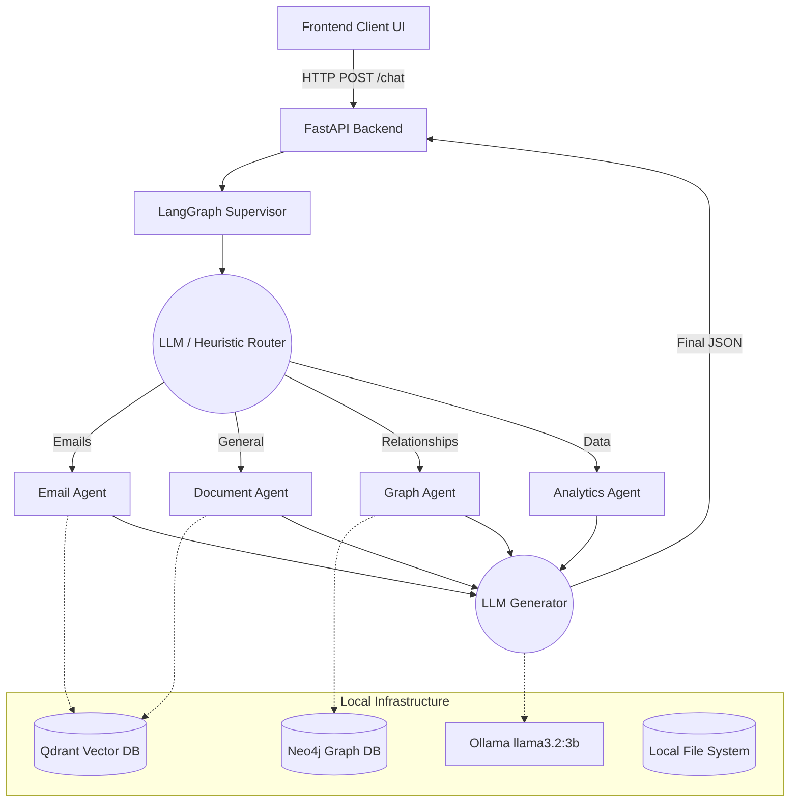
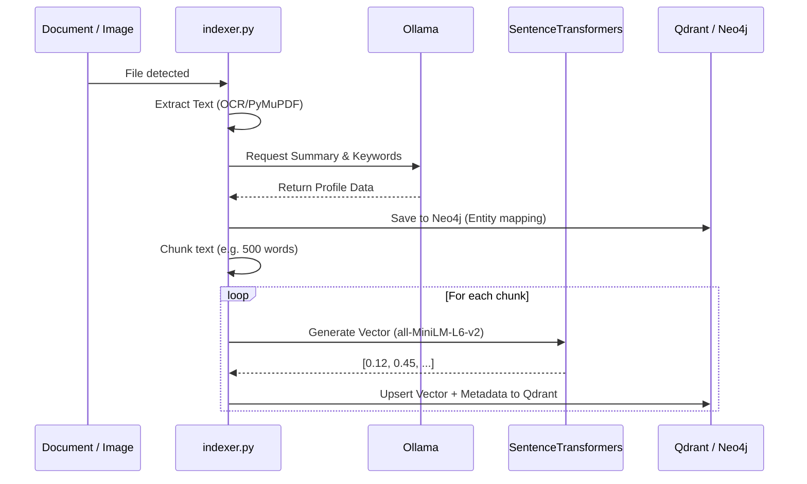
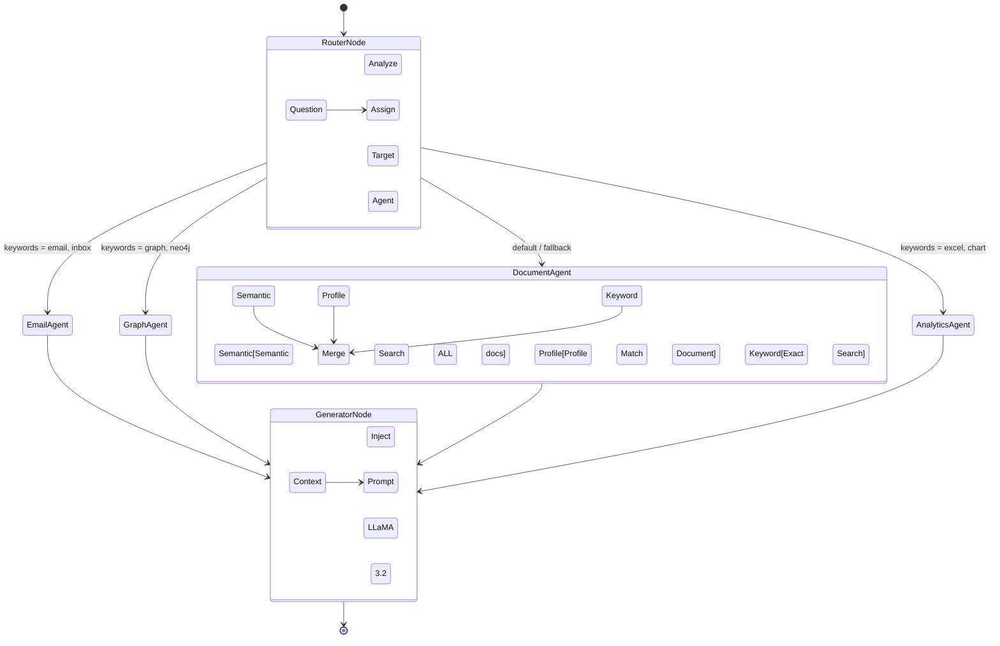

# Enterprise AI Knowledge Assistant - System Architecture

This document provides a comprehensive overview of the Enterprise AI Knowledge Assistant project. It outlines the methodology, technology stack, and architectural design of both the data ingestion and query routing systems.

## 1. Technology Stack

The project is built using a modern, localized AI stack to ensure data privacy and maximum speed without relying on external cloud APIs.

* **Frontend:** Vanilla HTML5, CSS3, and JavaScript (`app.js`).
* **Backend API:** FastAPI (Python) running on an asynchronous Uvicorn server.
* **LLM Engine:** Ollama running `llama3.2:3b` locally for all reasoning, routing, and text generation.
* **Embeddings:** `sentence-transformers` (`all-MiniLM-L6-v2`) for generating dense vector representations.
* **Vector Database:** Qdrant (runs locally on port 6333) for semantic similarity and hybrid searches.
* **Graph Database:** Neo4j for mapping document relationships and entities.
* **Agent Framework:** LangGraph (`StateGraph`) for stateful, multi-agent routing.

---

## 2. Core Methodology

The system operates on a **Retrieval-Augmented Generation (RAG)** methodology combined with a **Multi-Agent Workflow**. 

Instead of a single monolithic prompt, the system employs specialized "Agents" (Email, Graph, Analytics, Document). A central LangGraph Router analyzes incoming questions and delegates the task to the most appropriate agent. That agent searches the Qdrant database using highly specific filters (e.g., only searching `.eml` files for the Email agent), and the results are passed to a Generator node to formulate the final answer.

---

## 3. System Architecture 

Below is the high-level architecture of how the components interact.

---

## 4. Data Ingestion Pipeline

When a new file (PDF, Word, Excel, Image, Text) is added to the watched folders, the background Event Manager triggers the `indexer.py`.

### Ingestion Components:
* **`indexer.py`**: The orchestrator of the pipeline.
* **`file_readers.py` / `pdf_smart_reader.py`**: Specialized tools to extract raw text, utilizing `pdfplumber` or Tesseract OCR for diagrams and images.
* **`metadata_generator.py`**: Asks the LLM to write a concise summary of the document.
* **`keyword_generator.py`**: Asks the LLM to extract 5-10 core tags.

---

## 5. Query & Routing Pipeline (LangGraph)

When a user asks a question, the request enters the `supervisor_langgraph.py` pipeline.

### Agent Breakdown:
* **`document_agent.py`**: The workhorse. It uses an advanced 3-stage search:
  1. Finds the best matching document "Profile".
  2. Runs a semantic vector search across all chunks.
  3. Runs an exact keyword search to catch specific phrases.
* **`email_agent.py`**: Specifically filters the Qdrant database for chunks where the `file_type == "eml"` or the `source_folder == "emails"`.
* **`graph_agent.py`**: Bypasses Qdrant entirely and queries Neo4j to find relationship paths between concepts.
* **`analytics_agent.py`**: A placeholder agent intended for querying tabular CSV/Excel data in the future.
